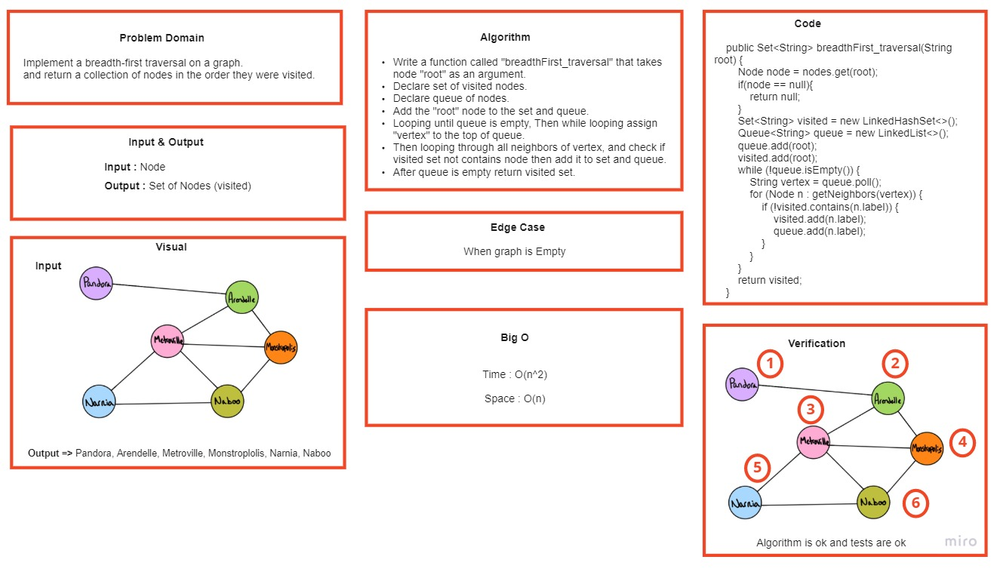
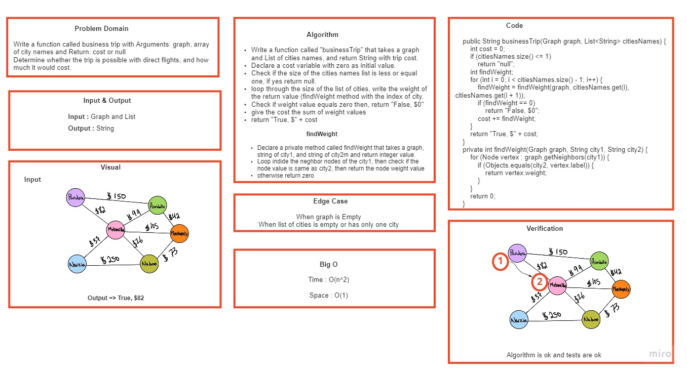

# Graphs

the Graph is a data structure that stores a certain of data. It represents a network that connects multiple points to each other.
In other words, a graph G (or g) is defined as a set of vertices (V) and edges (E) that connects vertices.

## Adjacency List

Adjacency List is the Array[] of Linked List, where array size is same as number of Vertices in the graph. Every Vertex has a Linked List. Each Node in this Linked list represents the reference to the other vertices which share an edge with the current vertex. The weights can also be stored in the Linked List Node.

## Challenge

Implement your own Graph. The graph should be represented as an adjacency list, and should include the following methods:

- add node
- add edge
- get nodes
- get neighbors
- size

## ِApproach && Efficiency

- add node
    Time: O(1)
    Space: O(n)

- add edge
  Time: O(n)
  Space: O(n)

- get nodes
  Time: O(1)
  Space: O(1)

- get neighbors
  Time: O(n)
  Space: O(n)

- size
  Time: O(1)
  Space: O(1)

## API

addNode(): Add nodes to the graph.

addEdge(): Add edges to connect the nodes.

getNodes(): Get a list of nodes.

getNeighbors(): Get the neighbors of each node without duplicates.

size(): Returns the size of the graph based on the number of nodes.

# Graph Breadth First

## Challenge Summary

Implement a breadth-first traversal on a graph. And return a collection of nodes in the order they were visited.

## Whiteboard Process

## Approach & Efficiency

Time: O(n^2)

Space: O(n)

- - -

# Graph Business Trip

## Challenge Summary

Write a function called business trip with Arguments: graph, array of city names and Return: cost or null
Determine whether the trip is possible with direct flights, and how much it would cost.

## Whiteboard Process

## Approach & Efficiency

Time: O(n^2)

Space: O(1)
