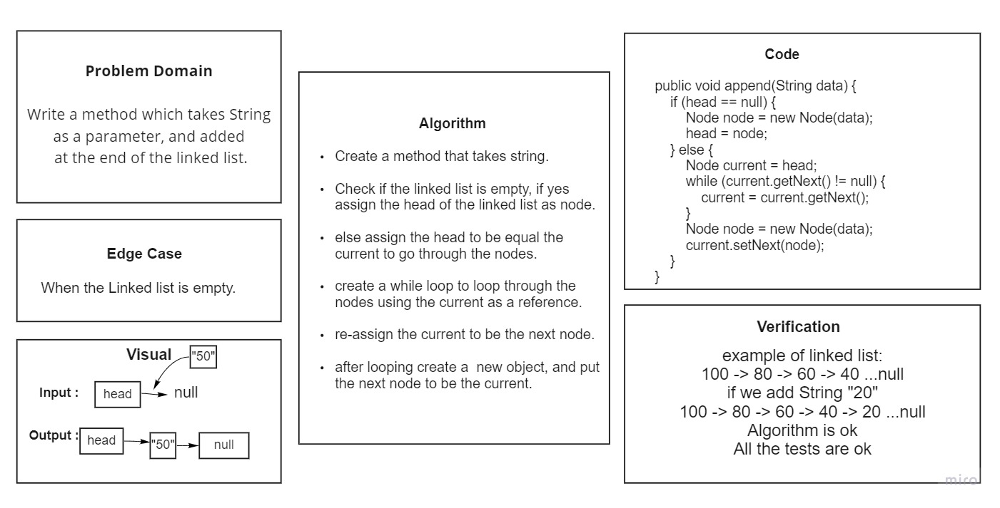
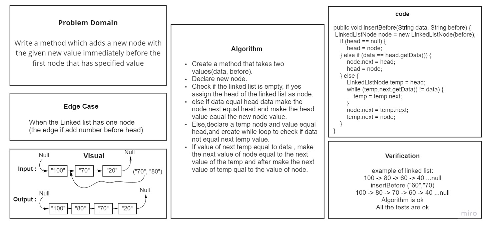
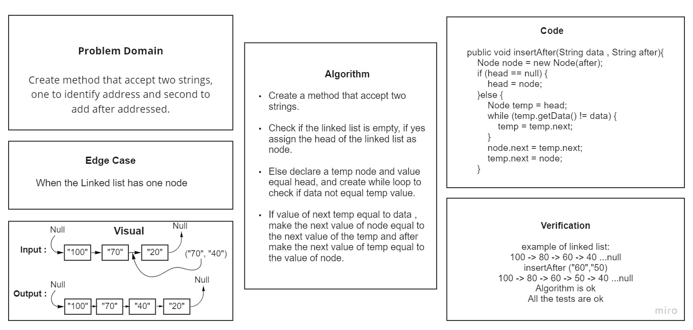
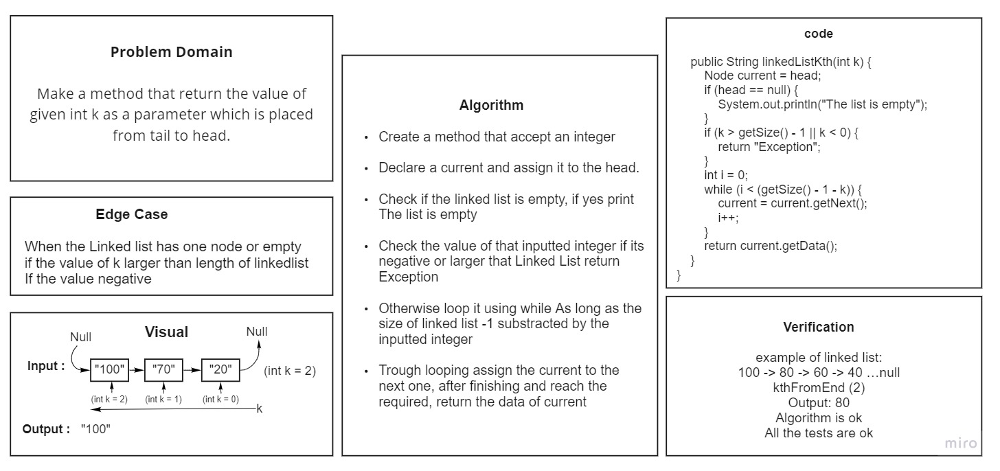
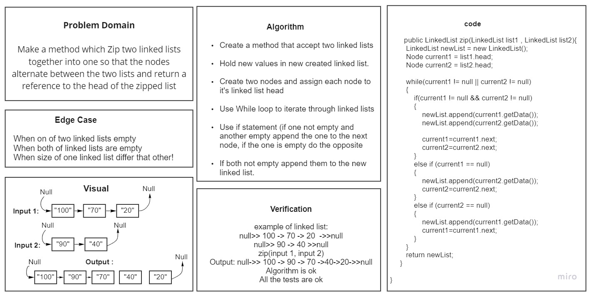

# Singly Linked List

The simplest type of linked-list, which mean that there is only one reference(the number of the node has).

Where nodes single connected to each other stated from the head, example: {1} -> {2} -> {3} -> NULL

## Challenge

Create a node class to Create a Linked List and use the methods to add the nodes (insert()), check of a value is in that list (includes()) and print the list content as a String and use append to add at the last, insertBefore to insert an added value before selected value,insertAfter to insert an added value after selected value (toString()) Any exceptions or errors that come from your code should be semantic. and make a test for every possible cases of linked list.

## Approach & Efficiency

```
while(current != null) {

        result += "{ " + current.getData() + " } -> ";

        current = current.getNext();
    }
```

That will confirm that the next node in the list isn't null

<<<<<<< HEAD
and the other methods using for loop... and we take the higher to count the Space and Time, where as the higher:

**Space -> o(1)**
**Time -> O(n)**

## API

### insert()

Add a new node with value as an arguments to the head of list.

**Space -> o(1)**
**Time -> O(1)**

### includes()

A method indicates whether that certain Node's value exists somewhere within the list and return a true otherwise return false.

**Space -> o(1)**
**Time -> O(n)**

### toString()

Returns: a string representing all the values in the Linked List, formatted as:
"{ a } -> { b } -> { c } -> NULL"

<<<<<<< HEAD
**Space -> o(1)**
**Time -> O(n)**

### append()

Add a new node with value as an arguments to the last of list.



**Space -> o(1)**
**Time -> O(n)**

### insertBefore()

insert new node with value before selected node value



**Space -> o(1)**
**Time -> O(n)**

### insertAfter()

insert new node with value after selected node value



**Space -> o(1)**
**Time -> O(n)**

## linked-list-kth

Return the value of given int k as a parameter which is placed from tail toward head.



**Space -> o(1)**
**Time -> O(n)**

## linked-list-zip

Make a method which Zip two linked lists together into one so that the nodes alternate between the two lists and return a reference to the head of the zipped list.



**Space -> o(1)**
**Time -> O(n)**
