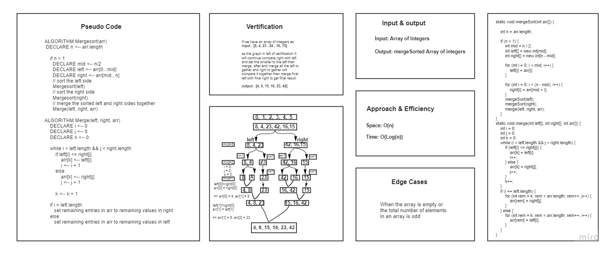

## Challenge 27: Merging Sort

# Challenge Summary

A Technique to sort an array depending on divide the array for left and and right then merge after compare and swap values to give sorted array.

## Whiteboard Process

## Approach & Efficiency

Space : O(n)

Time : O(n log (n))
