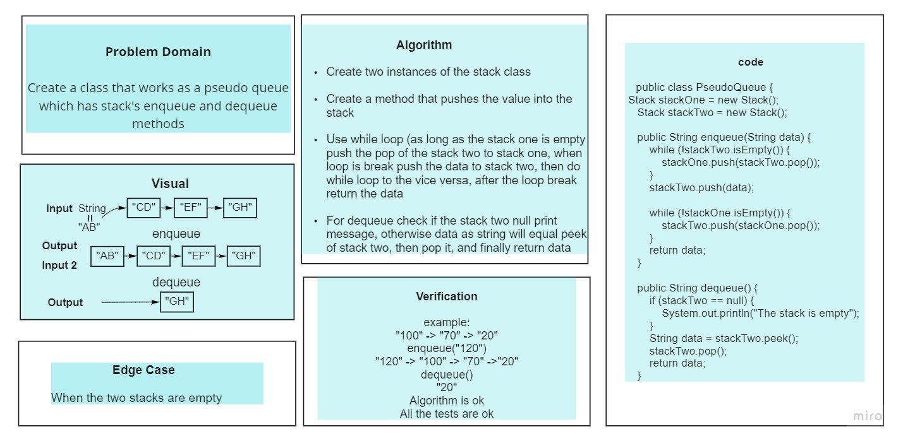
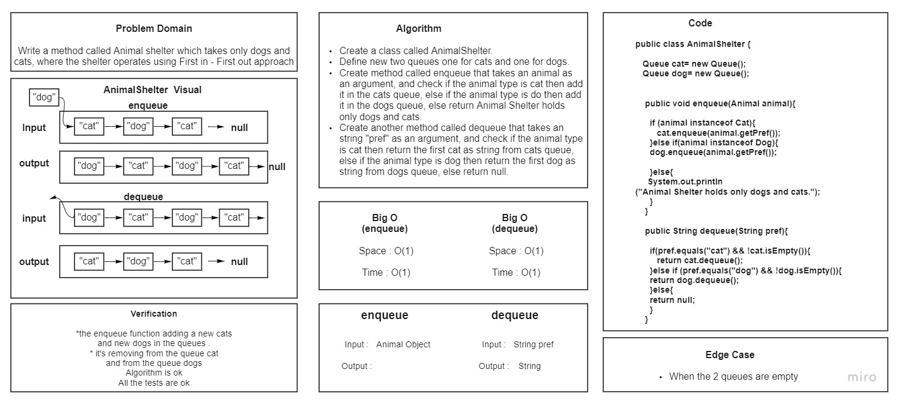

# Stacks and Queues

**Stack:** Linear data structures where Each Node references the next Node in the stack, but does not reference its previous. based on the concept: (FILO) First in last out, used in history and edit history like IDE and Microsoft office, Photoshop... and it's methods:

- push()
- pop()
- peek()

**Queue:** a linear structure It creates an empty Queue when instantiated. that follows a First In First Out (FIFO) and it's methods

- Enqueue

- Dequeue

- Peek

## Challenge

<!-- Description of the challenge -->

## Approach & Efficiency

- Space: O(1)
- Time : O(1)

## API

<!-- Description of each method publicly available to your Stack and Queue-->

### Stacks

- push() O(1) — adds an item to the top of the stack.

- pop() O(1) — removes the top element from the stack and returns it.

- peek() O(1) — returns the top element of the stack.

- isEmpty() - Returns Boolean indicating whether stack is empty.

### Queue

- Enqueue O(1): add an item to a queue (to the last)

- Dequeue O(1): remove an item from a queue(remove the oldest).

- Peek (O1): returns the front Node of the queue.

- isEmpty(): Boolean indicating whether or not the queue is empty.

## Stack-queue-pseudo

Problem Domain:

Create a class that works as a pseudo queue which has stack's enqueue and dequeue methods

Complicity:

enqueue: Space O(1), Time O(n)
dequeue: Space O(1), Time O(1)

---

## Stack-queue-animal-shelter

Problem Domain:

Write a method called Animal shelter which takes only dogs and cats, where the shelter operates using First in - First
out approach Complicity:

enqueue: Space O(1), Time O(1)
dequeue: Space O(1), Time O(1)

