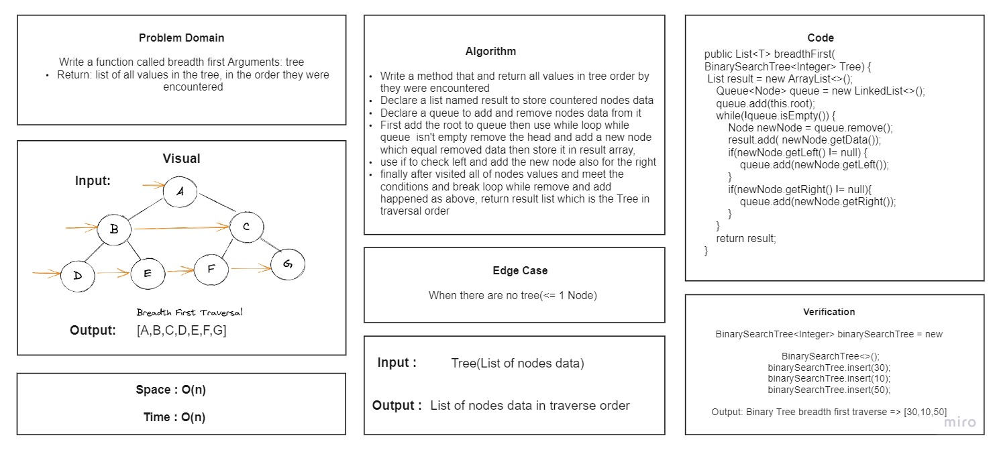
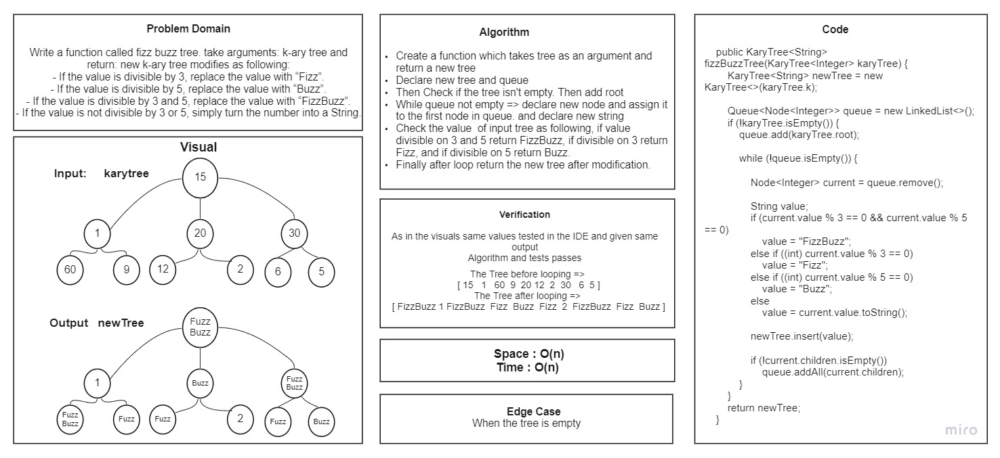

# Trees

- Trees are a collection of nodes (vertices), and they are linked with edges (pointers), representing the hierarchical
  connections between the nodes.
- The root is the node at the beginning of the tree
- Left - A reference to one child node, in a binary tree
- Right - A reference to the other child node, in a binary tree
- Edge - The edge in a tree is the link between a parent and child node
- Leaf - A leaf is a node that does not have any children Challenge

## Challenge

- Node : Node class has properties for the value stored in the node, the left child node, and the right child node.
- Binary Tree class : BinaryTree class Define a method for each of the depth first traversals.
- Binary Search Tree : BinarySearchTree class is a sub-class of the Binary Tree Class.

Code raise/throw a custom, semantic error that describes what went wrong in calling the methods.

## API

**Binary Tree class method :**

- preOrder() : root >> left >> right.
- inOrder(): left >> root >> right.
- postOrder(): left >> right >> root

### Binary Search Tree method (BST) :

- insert() : Takes a value and adds a new node with that value in the correct location in the binary search tree.
- Contains() : Takes a value and Returns a boolean indicating whether the value is in the tree at least once.

## Approach & Efficiency:

- insert(): Time : O(n). Space : O(n).
- Contains(): Time : O(n). Space : O(n).

---

## tree-max

### Problem Domain

Write a method that and finds the maximum value stored in the tree

### API

treemax() : find the max value in binary tree by compare the max root with max left and max right.

### Approach and Efficiency

treemax(): Time: O(1). Space: O(1).

## Breadth-first Traversal.

### Problem Domain

Write a function called breadth first Arguments: tree
Return: list of all values in the tree, in the order they were encountered

### API

breadthFirst(): a method to return all values in the tree in traversal order.

### Approach and Efficiency

breadthFirst(): Time: O(n). Space: O(n).

## FizzBuzz K-ary Tree

### Problem Domain

Write a function called fizz buzz tree. take arguments: k-ary tree and return: new k-ary tree
Create a new tree with the same structure as the original, but the values modified as follows:

- If the value is divisible by 3, replace the value with “Fizz”.
- If the value is divisible by 5, replace the value with “Buzz”.
- If the value is divisible by 3 and 5, replace the value with “FizzBuzz”.
- If the value is not divisible by 3 or 5, simply turn the number into a String.

### API

fizzBuzzTree(): a method that accept a tree as input and return new modified tree as mentioned above

### Approach and Efficiency

fizzBuzzTree(): Time: O(n). Space: O(n).
